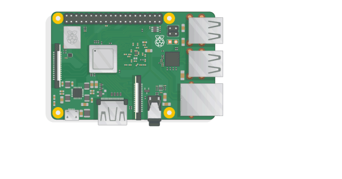

# 写在前面

## 为什么要写这个系列的文章

为了充分利用手头的树莓派来改善生活,帮助自己进行一些冗杂的小事处理

```
$ give something to raspberry-pi
```


 这系列文章可能更偏向于记录操作步骤来方便一个新的树莓派的初始化上手配置.而不是一个大而全的树莓派入门贴,如果对其中的某些操作或者术语有所疑问,可以在搜索引擎中进行搜索了解学习


所以,让我们开始吧~



```
// hero, it's your turn to use the raspberry pi to save the world
echo 'Hi , Raspberry Pi ~'
```


