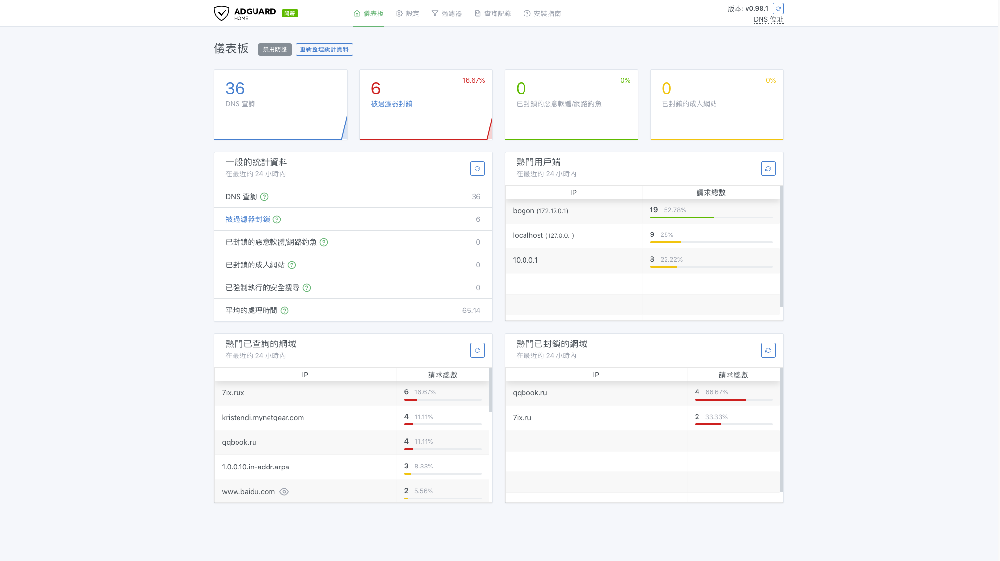
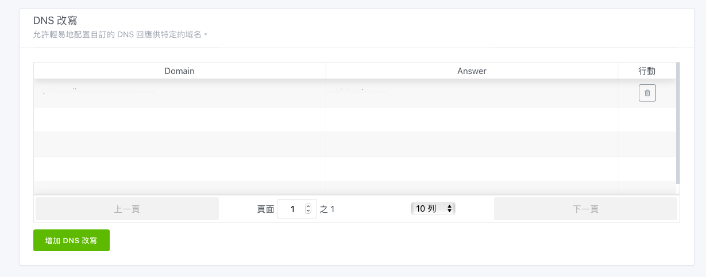

# 搭建内网 dns 服务器\(2\)-Adguard Home



 作为pi-hole 的有效竞品,而且是商业公司维护的,对个人免费开源使用,对我来说吸引力还是很大的.

> [https://hub.docker.com/r/adguard/adguardhome](https://hub.docker.com/r/adguard/adguardhome)

```bash
sudo docker run --name adguardhome --restart=always -v /etc/adguardhome/work:/opt/adguardhome/work -v /etc/adguardhome/confdir:/opt/adguardhome/conf -p 53:53/tcp -p 53:53/udp  -p 80:80/tcp -p 443:443/tcp -p 853:853/tcp -p 3000:3000/tcp -d adguard/adguardhome:armhf-latest
```

安装完成后记得更改当前树莓派的 dns

```bash
sudo vim /etc/resolv.conf
# 最后一行更改为
# nameserver 127.0.0.1
```


docker 仓库页提供的启动命令包含68 和67端口,如果不打算用 Adguard Home 进行 DHCP,大可以不启用  '-p 67:67/udp -p 68:68/tcp -p 68:68/udp'


安装之后访问3000端口进行初始化配置,**初始化配置完成后3000端口将不再可用,使用80端口管理后台**



总得来说感觉上页面比 pi-hole 精细了不少,操作体验尚可.值得一提的是,终于可以在页面上配置 自定义 dns 记录了



相交于pi-hole 需要在命令行修改 dns 记录并且没有一个地方能够看到所有的自定义 dns 记录,adguard home 显然在体验上好了很多.

另外,pi-hole 仅支持 hosts 形式的广告拦截,而 Adguard Home 还支持 Adblock Plus 格式的广告拦截,可选的过滤文件更多了.

