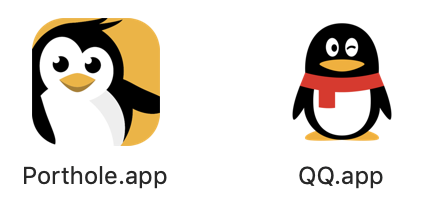
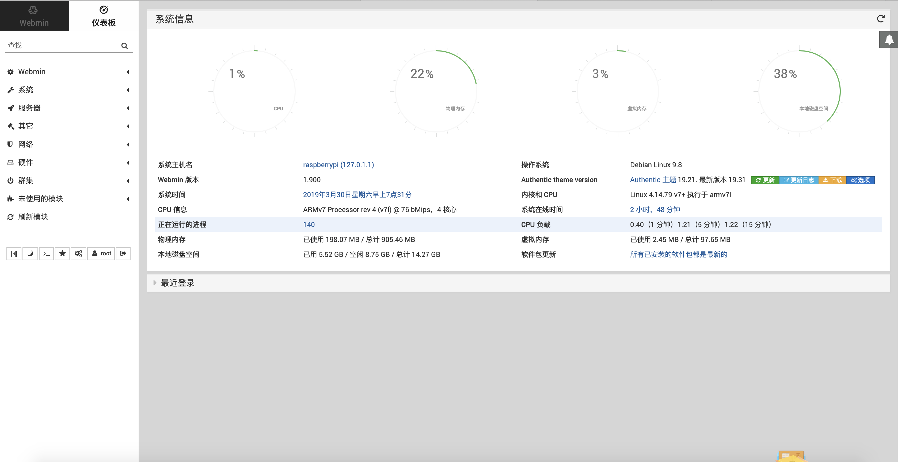
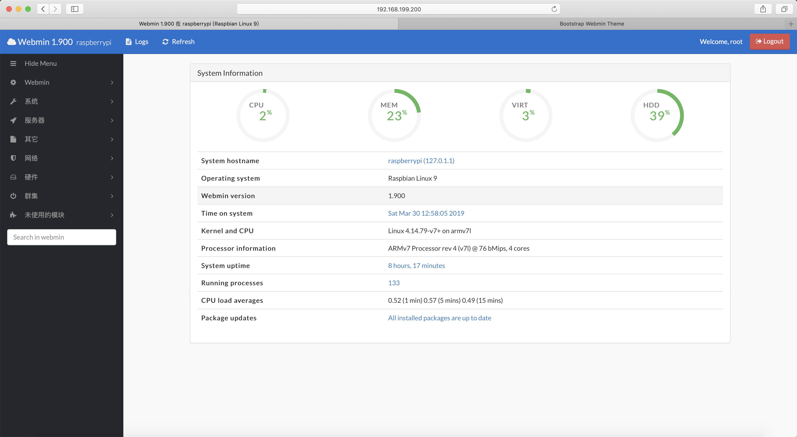

# 跨越网络,亲密无间


如果在一个内网里,可以直接ssh或者vnc登录树莓派,那么如果在其他网络环境下呢?




* 端口转发并不安全

## 两种在线免费服务体验



#### 原理

```bash
/opt/dataplicity/agent/dataplicity --server-url https://api.dataplicity.com/ run
# supervisord 启动了一个常驻进程与服务器通信
```

* 在线 terminal 体验不错
* 支持转发80端口 http 服务
* 有各种系统\(包括android\)的 App
* 支持端口转发\(免费账户仅支持80 22 5901端口\)
* icon 可爱



```bash
# 如果需要管理员权限
su pi # 切换到 pi 用户 
sudo su
```



> 一种更高级的远程多设备管理系统

* 支持多设备在线分发脚本并跟踪多任务执行状态
* 控制面板网页打开有点慢.

## Webmin

> 功能强大的基于Web的Unix系统管理工具

```bash
sudo apt-get install perl libnet-ssleay-perl openssl libauthen-pam-perl libpam-runtime libio-pty-perl apt-show-versions
wget http://prdownloads.sourceforge.net/webadmin/webmin_1.890_all.deb
sudo dpkg --install webmin_1.890_all.deb

# https://192.168.199.200:10000
vi /etc/webmin/miniserv.conf
ssl=0

#ssl=0     ==> http connection
#ssl=1     ==> https conection
sudo /etc/init.d/webmin restart
# # http://192.168.199.200:10000
# 端口可通过 /etc/webmin/miniserv.conf 的 第一行 port 来更改
```


记得改默认用户名和密码 !

默认用 root 用户 以及 root 用户密码作为登录密码


这是官方的"面向21世纪的"主题,但是仪表盘经常会加载不出来



所以我强烈推荐你使用下面这个主题




安装之后长这样:



更让人开心的是,这个主题的移动端适配优秀 🙋🏼‍♀️

