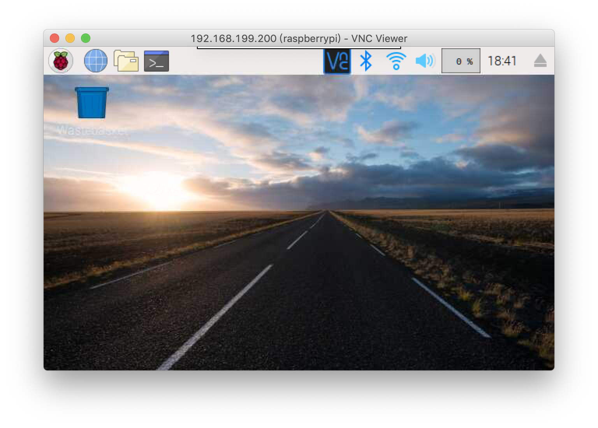

# 让你的树莓派更加懂你

## 启动 vnc

```bash
sudo raspi-config
# 5 Interfacing Options -> P3 VNC -> YES 开启 VNC
```

这样就可以通过vnc登录树莓派了





## 更新软件源

> 特别鸣谢 [https://mirror.tuna.tsinghua.edu.cn/help/raspbian/](https://mirror.tuna.tsinghua.edu.cn/help/raspbian/)

```bash
sudo vi /etc/apt/sources.list
# 更改为
deb http://mirrors.tuna.tsinghua.edu.cn/raspbian/raspbian/ stretch main non-free contrib
deb-src http://mirrors.tuna.tsinghua.edu.cn/raspbian/raspbian/ stretch main non-free contrib
# for debian 9

sudo apt-get update
# 享受飞一般的下载速度, 此刻尽丝滑 ~
```

## 让你的树莓派和你保持时间同步\(矫正时间\)

* 树莓派矫正时间
* `sudo dpkg-reconfigure tzdata` 选择 Asian -&gt; Shanghai 完成时区更改
* `sudo apt-get install ntp` 安装时间校准服务 

特别鸣谢 :



```bash
sudo ntpd -s -d
sudo vi /etc/ntp.conf

# 找到以下
# You do need to talk to an NTP server or two (or three).
# server ntp.your-provider.example
# 添加

server ntp.fudan.edu.cn iburst perfer
server time.asia.apple.com iburst
server asia.pool.ntp.org iburst
server ntp.nict.jp iburst
server time.nist.gov iburst

# 保存后
sudo /etc/init.d/ntp restart
```

## cron 日志展示

```bash
sudo vi /etc/rsyslog.conf
#  对下面行取消注释

# cron.*             /var/log/cron.log
```

重启 rsyslog `sudo service rsyslog restart`

然后 cron 的执行 log 就会出现在 /var/log/cron.log

## rz sz 是个好东西

```bash
sudo apt-get install lrzsz
```

## 别忘了升级到 vim

```bash
sudo apt-get install vim
sudo select-editor

#Select an editor.  To change later, run 'select-editor'.
# 1. /bin/ed
# 2. /bin/nano        <---- easiest
# 3. /usr/bin/vim.basic
# 4. /usr/bin/vim.tiny
#
# Choose 1-4 [2]: 4
```

