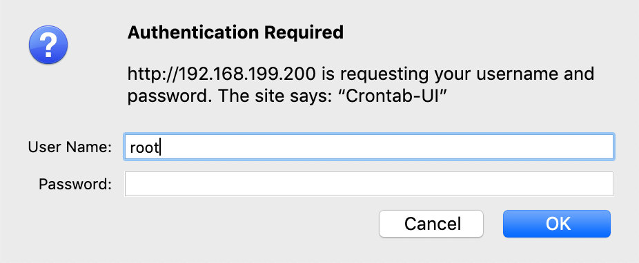

# Cron 任务管理

我们希望能够有个方便的办法清晰地看到树莓派上运行的各种定时任务，为了后续各种脚本的持续追踪运行情况，排除了php相关项目，我们选定了开源的 [**crontab-ui**](https://github.com/alseambusher/crontab-ui)\*\*\*\*

## 准备工作

### Node.js & NPM




下面步骤有点慢，敬请耐心等待


```bash
wget https://nodejs.org/dist/v10.15.3/node-v10.15.3-linux-armv7l.tar.xz
tar xfv  node-v10.15.3-linux-armv7l.tar.xz
cd node-v10.15.3-linux-armv7l/
sudo cp -R * /usr/local/

# 尝试是否安装成功
node -v
npm -v

# 换淘宝源 cnpm (记得sudo ，否则 permission deny
sudo npm install -g cnpm --registry=https://registry.npm.taobao.org
```

### Crontab-ui 安装

```bash
sudo cnpm install -g crontab-ui
# 命令行直接执行需要sudo权限
sudo HOST=0.0.0.0 PORT=9000 crontab-ui --autosave
# 其他详见下面项目地址
```



## 我们当然希望它能够开机自启并常驻内存了

### systemd 配置

这里有篇不错的文档介绍



添加下面文件



```bash
#!/bin/bash
sudo HOST=0.0.0.0 PORT=9000 /usr/local/bin/crontab-ui ----autosave
```





```bash
[Unit]
Description= crontab-ui
After=rc-local.service

[Service]
Type=simple
User=root
Group=root
WorkingDirectory=/home
ExecStart=/usr/local/bin/

Restart=always

[Install]
WantedBy=multi-user.target
```



允许并启动服务

```bash
sudo systemctl enable crontabui.service
# 会自动在 /etc/systemd/system/multi-user.target.wants 下创建相链接
sudo systemctl start crontabui
```

## Nginx 也要妥善配置好

添加



```bash
location /crontab/ {
		proxy_pass http://127.0.0.1:9000/;
    		proxy_redirect http://$host:9000/ /crontab/;
    		proxy_set_header Host $host;
}
```



另外，项目有资源是绝对路径的，没法配置，github上的 merge 还没合并，所以

```bash
sudo mkdir -p /usr/share/nginx/html/fonts/
cd /usr/share/nginx/html/fonts/
sudo wget 'http://localhost:9000/fonts/glyphicons-halflings-regular.woff2'
```

美中不足，项目并没有进行用户身份校验，如果通过端口转发允许外网访问，无疑很危险，所以通过 Nginx 进行权限校验设置。修改后相关 Nginx 配置如下



```bash
location /crontab/ {
		    auth_basic           "Crontab-UI";
    		auth_basic_user_file /etc/nginx/conf.d/crontabpasswd;
		    proxy_pass http://127.0.0.1:9000/;
    		proxy_redirect http://$host:9000/ /crontab/;
    		proxy_set_header Host $host;
}
```



同时添加

```bash
# 使用 `openssl passwd 密码` 得到下面想要的加密的密码
root:加密的密码
# 下面还可以加其他用户
```



之后重启 Nginx,这样以后打开/crontab 会自动要求进行身份校验


缺陷: 由于项目并不原生支持相对路径,所以 查看 cron 任务的 log等接口尚未优雅的解决

相关 issue 如下

[https://github.com/alseambusher/crontab-ui/pull/70](https://github.com/alseambusher/crontab-ui/pull/70)


一个折中但并不优雅的解决方案\(因为 crontab-ui 的日志地址为 [http://host:port/logger?id=](http://192.168.199.200:9000/logger?id=2vDdZaJCzCUKLQIH) \)



```bash
location /logger{
		proxy_pass http://127.0.0.1:9000;
	}
location /save{
		proxy_pass http://127.0.0.1:9000;
}
location /stop{
		proxy_pass http://127.0.0.1:9000;
}
location /runjob{
		proxy_pass http://127.0.0.1:9000;
}
location /remove{
		proxy_pass http://127.0.0.1:9000;
}
```




## 后记

在调试复杂的 nginx 代理转发时,一个小技巧是在 nginx 中设置



```bash
rewrite_log on;
```



这样在 `error.log` 中就可以看到 `404` 的报错请求的实际转发地址了

## 应用随想

我用 cron 部署了一个简单的清晨闹钟,每早8点开始播放10分钟自然声音.

#### 自然音乐来自 



```bash
# 尤其注意,这里手动设置了--vol 音量,因为 omxplayer 的播放音量并不受 alsamixer 控制
# 对了,omxplayer 的音量范围 [-6000,0] ,default 0 (max)
timeout 300 omxplayer --vol -3000 --loop /home/pi/app/pypi/sounds/birds.mp3
# cron
# 0 8 * * *
```

### 部署任务的时候发现了一个问题

crontab-ui 有时候会因为部署的任务文字编码或者 cron 时间格式问题而导致无法打开,

```bash
crontab-ui --reset
```

参见



另外,crontab-ui 部署的 cron 任务在 `/var/spool/cron/crontabs` 下


