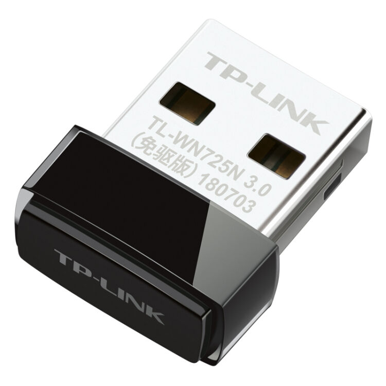

# 网络相关

买了个外置网卡想倒腾点网络相关的东西,之前用过tp-link的WN722N,确实非常好用,windows以及linux都可以即插即用,但是有点贵,所以这次买了WN725N





```bash
pi@raspberrypi:~ $ lsusb
Bus 001 Device 005: ID 0781:5567 SanDisk Corp. Cruzer Blade
Bus 001 Device 007: ID 0bda:1a2b Realtek Semiconductor Corp.
Bus 001 Device 003: ID 0424:ec00 Standard Microsystems Corp. SMSC9512/9514 Fast Ethernet Adapter
Bus 001 Device 002: ID 0424:9514 Standard Microsystems Corp. SMC9514 Hub
Bus 001 Device 001: ID 1d6b:0002 Linux Foundation 2.0 root hub
```

其中 Realtek Semiconductor Corp 便是刚插上的外置网卡

用不了,退了,安装不上驱动.

## Network Manager 安装

```bash
sudo apt-get install network-manager
# 安装结束会自动重连网络,所以不要方,虽然连接断了,但是从路由器管理页能找到新的ip

sudo systemctl enable NetworkManager   
sudo service NetworkManager start
#[status|start|stop|reload|restart]
```

#### 注意,NetworkManager会自动在每次连接wifi的时候随机生成mac地址,但是我们在内网路由器通过mac地址绑定静态内网ip的情况下,并不希望mac地址随机更改,所以

修改 /etc/NetworkManager/NetworkManager.conf ,添加下面几行

```bash
[connection]
wifi.mac-address-randomization=1
 
[device]
wifi.scan-rand-mac-address=no
```


