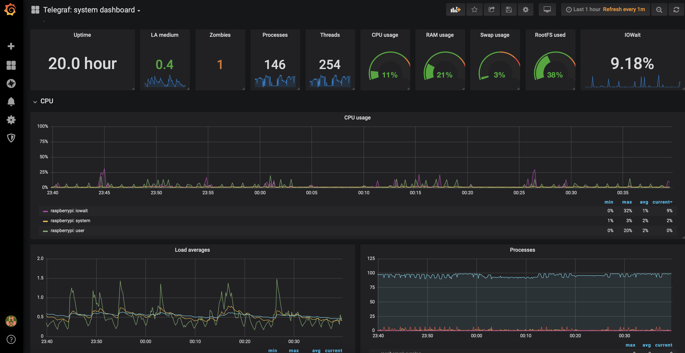
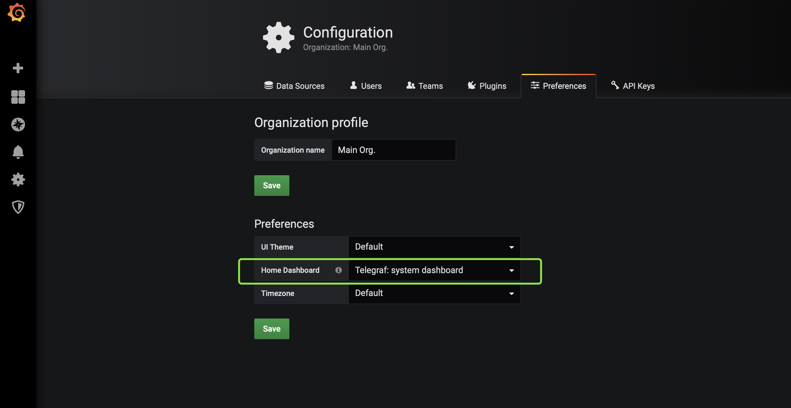

# 我想要能看到树莓派的性能监控曲线


树莓派的架构是 armhf


## Influxdb



```bash
wget -qO- https://repos.influxdata.com/influxdb.key | sudo apt-key add -
source /etc/os-release
test $VERSION_ID = "7" && echo "deb https://repos.influxdata.com/debian wheezy stable" | sudo tee /etc/apt/sources.list.d/influxdb.list
test $VERSION_ID = "8" && echo "deb https://repos.influxdata.com/debian jessie stable" | sudo tee /etc/apt/sources.list.d/influxdb.list
test $VERSION_ID = "9" && echo "deb https://repos.influxdata.com/debian stretch stable" | sudo tee /etc/apt/sources.list.d/influxdb.list
sudo apt-get update
sudo apt-get install influxdb
sudo systemctl enable influxdb
sudo service influxdb start
```

之后可以执行命令测试是否启动成功

```bash
curl -G http://localhost:8086/query --data-urlencode "q=show databases"
```

期望得到类似的返回

```javascript
{"results":[{"statement_id":0,"series":[{"name":"databases","columns":["name"],"values":[["_internal"],["telegraf"]]}]}]}
```

## Telegraf

```bash
wget https://dl.influxdata.com/telegraf/nightlies/telegraf_nightly_armhf.deb
sudo dpkg -i telegraf_nightly_armhf.deb
sudo service telegraf start
sudo systemctl enable telegraf
```

默认配置文件位于

> /etc/telegraf/telegraf.conf

### 需要对其进行几点小更改

```text
## Multiple URLs can be specified for a single cluster, only ONE of the ## urls will be written to each interval. 
# urls = ["unix:///var/run/influxdb.sock"] 
# urls = ["udp://127.0.0.1:8089"] 
# influxdb http地址，由于是宿主机直接安装，直接访问本地8086端口即可。 
urls = ["http://127.0.0.1:8086"] 
database = "telegraf"
skip_database_creation = false
timeout = "5s"
```

#### 修改之后记得重启服务

```bash
# 小贴士
# 启动
systemctl start telegraf
# 停止
systemctl stop telegraf
# 重启
systemctl restart telegraf
# 查看服务状态
systemctl status telegraf
```

## Grafana



只不过通过 apt-get 安装的方式太慢了呜呜呜...所以还是下载安装包安装吧

```bash
wget https://dl.grafana.com/oss/release/grafana_6.1.0-beta1_armhf.deb
sudo dpkg -i grafana_6.1.0-beta1_armhf.deb

sudo /bin/systemctl daemon-reload
sudo /bin/systemctl enable grafana-server
sudo /bin/systemctl start grafana-server
```

默认监听 **`3000`** 端口 首次启动需要配置 datasource

* URL [http://localhost:8086](http://localhost:8086)
* Database `telegraf`
* User `root`
* Password `root`



对于懒人而言,最快的方式莫过于导入现成的 dashboard


[Telegraf: system dashboard](https://grafana.com/dashboards/928)




设置导入的 dashboard 作为 HomePage



大功告成,撒花 🎉 🎉 🎉

